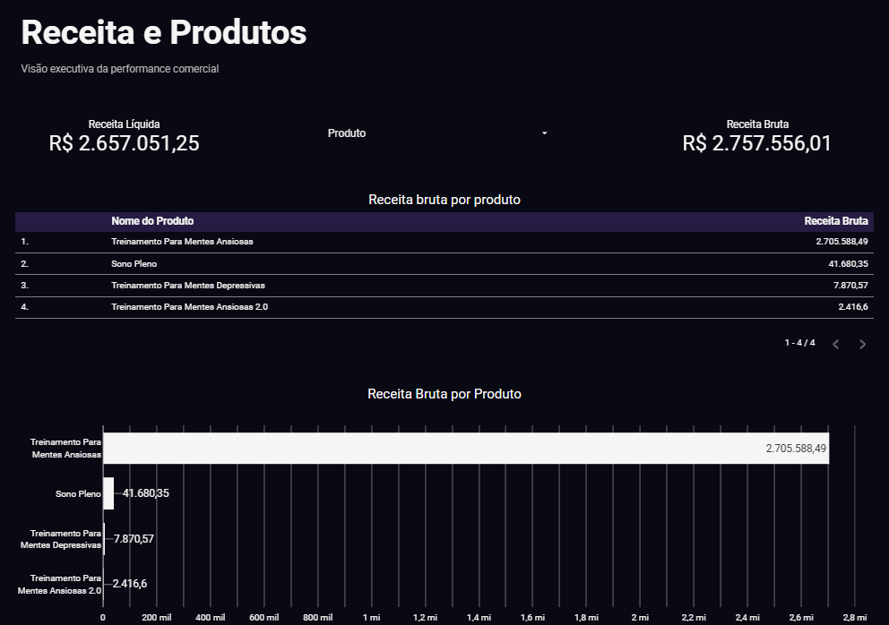
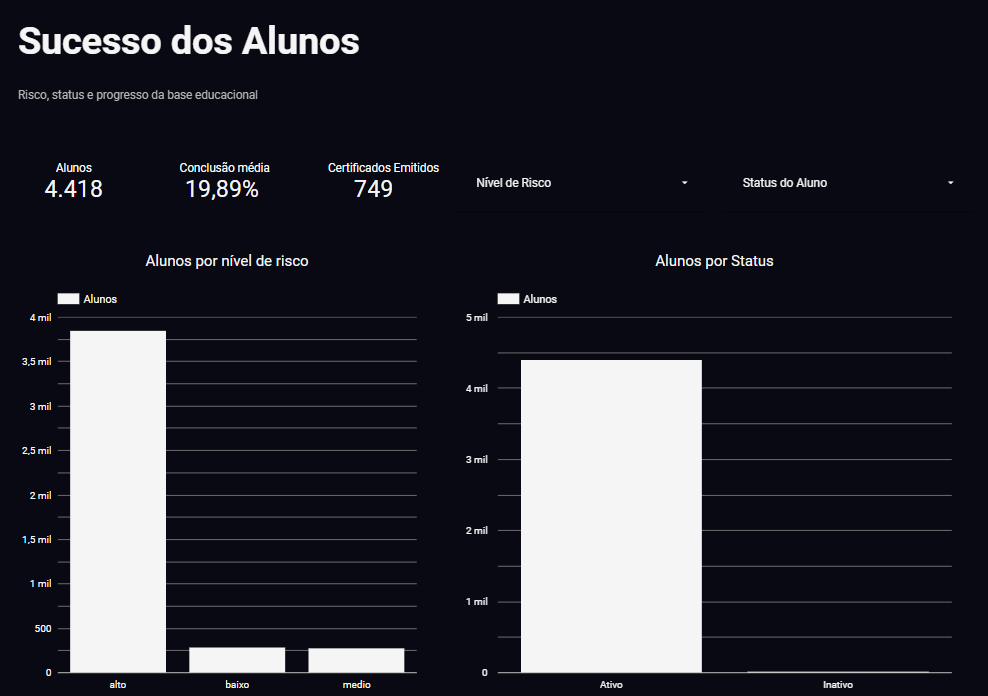
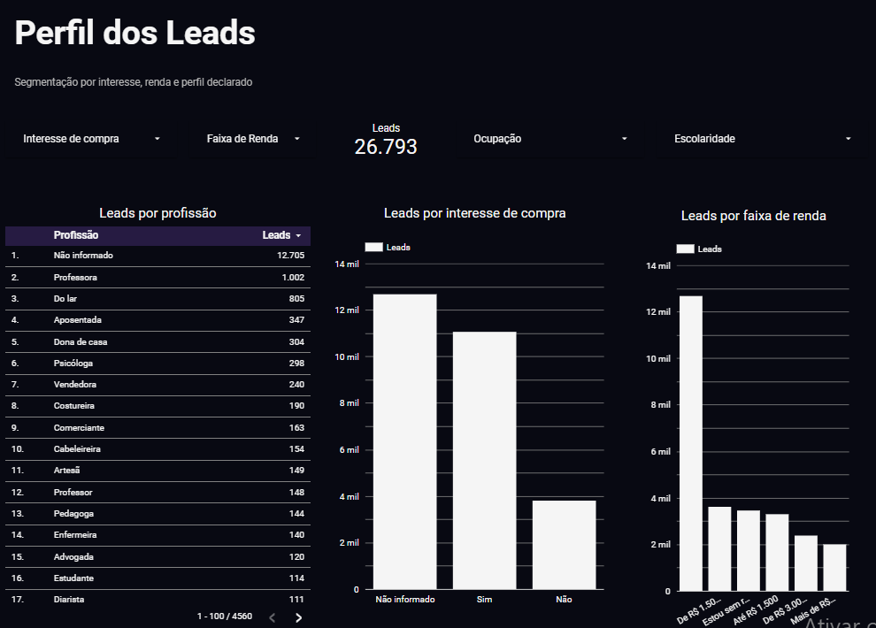
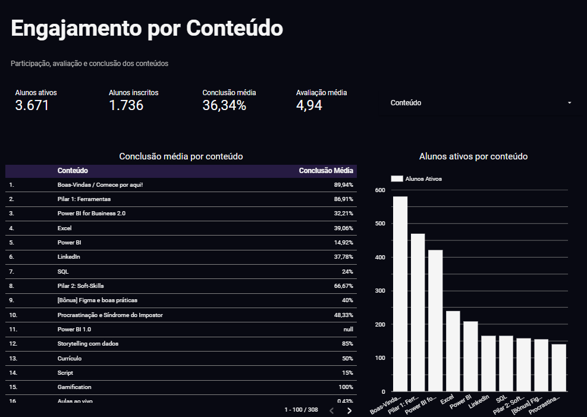

# Datamundo — Dashboard Executivo

Dashboard executivo desenvolvido para consolidar indicadores comerciais e educacionais em uma visão analítica única, usando dados tratados no BigQuery e visualização no Looker Studio.

O projeto reúne análises de receita, perfil de leads, sucesso dos alunos e engajamento por conteúdo, com foco em clareza visual, métricas confiáveis e uma versão segura para apresentação pública.

🔗 **[Acesse o dashboard no Looker Studio](https://datastudio.google.com/u/0/reporting/18c3c107-80bd-49aa-9cd7-0ae74a1a7a8b/page/HCywF)**

---

## Visão geral

O projeto **Datamundo — Dashboard Executivo** foi criado para transformar dados comerciais, educacionais e de engajamento em indicadores visuais de fácil interpretação.

A solução permite acompanhar:

- Receita bruta e receita líquida;
- Receita por produto;
- Total de leads únicos;
- Perfil dos leads por profissão, interesse de compra e faixa de renda;
- Total de alunos;
- Conclusão média;
- Certificados emitidos;
- Alunos por nível de risco;
- Alunos por status;
- Alunos ativos por conteúdo;
- Avaliação média dos conteúdos.

---

## Stack utilizada

- Google Cloud Storage
- BigQuery
- Dataform
- Looker Studio
- SQL
- Modelagem em camadas: `raw`, `staging` e `mart`

---

## Arquitetura analítica

O projeto segue uma lógica de camadas para organizar, tratar e disponibilizar os dados para consumo no dashboard.

```text
Dados brutos
   ↓
Cloud Storage
   ↓
BigQuery RAW
   ↓
Dataform / Staging
   ↓
Tabelas MART
   ↓
Looker Studio
```

As tabelas `mart` são usadas como fonte final do dashboard. Isso evita que o relatório consuma diretamente dados brutos ou pouco tratados, reduzindo o risco de métricas duplicadas, campos técnicos expostos e inconsistências de agregação.

---

## Páginas do dashboard

### 1. Receita e produtos

Página voltada para a análise comercial do projeto.

Principais indicadores:

- Receita líquida;
- Receita bruta;
- Receita por produto;
- Comparação visual entre produtos.



---

### 2. Sucesso dos alunos

Página voltada para acompanhamento educacional e retenção.

Principais indicadores:

- Total de alunos;
- Conclusão média;
- Certificados emitidos;
- Alunos por nível de risco;
- Alunos por status.



---

### 3. Perfil dos leads

Página voltada para análise do perfil dos leads captados.

Principais indicadores:

- Leads únicos;
- Leads por profissão;
- Leads por interesse de compra;
- Leads por faixa de renda.



---

### 4. Engajamento por conteúdo

Página voltada para análise de performance dos conteúdos.

Principais indicadores:

- Alunos ativos;
- Alunos inscritos;
- Conclusão média;
- Avaliação média;
- Alunos ativos por conteúdo;
- Certificados emitidos por conteúdo.



---

## Principais decisões técnicas

Durante o desenvolvimento do projeto, foram aplicadas decisões para melhorar a qualidade da análise e a segurança da versão pública:

- Uso de tabelas `mart` como fonte final do dashboard;
- Correção de métricas que estavam sendo somadas indevidamente;
- Tratamento de valores nulos como **“Não informado”**;
- Padronização de nomes técnicos para nomes amigáveis;
- Remoção de tabelas com dados individuais na versão pública;
- Validação dos filtros e fontes de dados antes do compartilhamento;
- Criação de uma versão mais segura para portfólio.

---

## Cuidados com segurança e privacidade

A versão pública do dashboard foi ajustada para reduzir a exposição de informações sensíveis.

Foram removidas tabelas de detalhe que poderiam exibir informações individuais de leads ou alunos, mantendo apenas análises agregadas. Esse cuidado é importante porque a base envolve informações relacionadas a perfil, renda, comportamento de alunos, interesse de compra e indicadores educacionais.

---

## Aprendizados do projeto

Este projeto envolveu práticas importantes de análise de dados e Business Intelligence, como:

- Organização de dados em camadas analíticas;
- Modelagem de tabelas finais para consumo em dashboard;
- Criação de indicadores comerciais e educacionais;
- Tratamento de valores nulos;
- Revisão de agregações no Looker Studio;
- Validação de fontes de dados;
- Construção de dashboard executivo;
- Preparação de uma versão segura para apresentação pública.

---

## Possíveis melhorias futuras

Algumas melhorias que podem ser adicionadas em versões futuras:

- Criar análise temporal de receita e leads;
- Adicionar segmentação por canal de venda;
- Criar alertas para alunos em alto risco;
- Automatizar a atualização das tabelas finais;
- Criar documentação técnica dos campos e métricas;
- Implementar controle de acesso por perfil de usuário;
- Adicionar indicadores de conversão ao longo do funil.

---

## Estrutura sugerida do repositório

```text
datamundo-dashboard-executivo/
│
├── README.md
│
├── images/
│   ├── 01_receita_produtos.png
│   ├── 02_sucesso_alunos.png
│   ├── 03_perfil_leads.png
│   └── 04_engajamento_conteudo.png
│
└── docs/
    └── implantacao_tecnica.md
```

> Observação: os arquivos de dados brutos não devem ser publicados no repositório caso contenham informações pessoais, sensíveis ou identificáveis.

---

## Status do projeto

✅ Dashboard validado em modo leitura.  
✅ Métricas revisadas.  
✅ Valores nulos tratados.  
✅ Versão pública ajustada para reduzir exposição de dados individuais.  
✅ Projeto pronto para apresentação em portfólio.

---

## Autoria

Projeto desenvolvido por **Cecilia Xavier** como parte de um estudo prático de análise de dados, modelagem analítica e construção de dashboards executivos com ferramentas Google Cloud.
